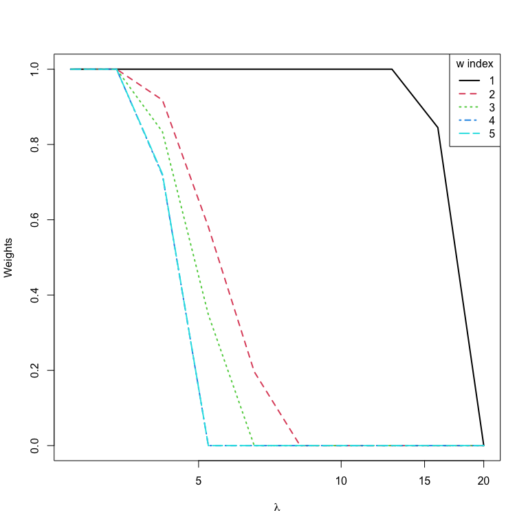

`ktweedie`: Kernel-based Tweedie compound Poisson gamma model using
high-dimensional covariates for the analyses of zero-inflated response
variables.
================

<!-- badges: start -->

[](https://github.com/ly129/ktweedie/actions)
<!-- badges: end -->

## Introduction

`ktweedie` is a package that fits nonparametric Tweedie compound Poisson
gamma models in the reproducing kernel Hilbert space. The package is
based on two algorithms, the `ktweedie` for kernel-based Tweedie model
and the `sktweedie` for sparse kernel-based Tweedie model. The
`ktweedie` supports a wide range of kernel functions implemented in the
`R` package `kernlab` and the optimization algorithm is a
Broyden–Fletcher–Goldfarb–Shanno (BFGS) algorithm with bisection line
search. The package includes cross-validation functions for
one-dimensional tuning of the kernel regularization parameter

and for two-dimensional joint tuning of one kernel parameter and
.
The `sktweedie` uses variable weights to achieve variable selection. It
is a meta-algorithm that alternatively updates the kernel parameters and
a set of variable weights.

The `ktweedie` solves the problem

\mathbf{K}_{i}^{\top}\boldsymbol{\alpha}}}{1-\rho}-\frac{e^{(2-\rho)\mathbf{K}_{i}^{\top}\boldsymbol{\alpha}}}{2-\rho}\right)+\lambda\boldsymbol{\alpha}^{\top}\mathbf{K}\boldsymbol{\alpha}\right\} ,")

where
")
is the index parameter,

is the dispersion parameter,

is an

kernel matrix computed according to the user-specified kernel function
"),
whose entries are
")
are calculated based on the
-dimensional
predictors from subjects
.
In the kernel-based Tweedie model, the mean parameter

for the
-th
observation is modelled by

)=\sum_{j=1}^n \alpha_j K(\mathbf x_{i}, \mathbf x_j).")

The `sktweedie` solves

![\begin{aligned}
&\min\_{\boldsymbol{\alpha}, \mathbf{w}}\left\\{ -\sum\_{i=1}^{n}\frac{1}{\phi}\left(\frac{y\_{i}e^{(1-\rho)\mathbf{K(w)}\_{i}^{\top}\boldsymbol{\alpha}}}{1-\rho}-\frac{e^{(2-\rho)\mathbf{K(w)}\_{i}^{\top}\boldsymbol{\alpha}}}{2-\rho}\right)+\lambda_1\boldsymbol{\alpha}^{\top}\mathbf{K(w)}\boldsymbol{\alpha} +\lambda_2 \mathbf{1}^\top \mathbf{w} \right \\}\\\\
& \qquad \qquad \mathrm{s.t.\\ \\ \\ } w_j\in \[0,1\],\\ j=1,\ldots,p,
\end{aligned}](https://latex.codecogs.com/png.image?%5Cdpi%7B110%7D&space;%5Cbg_white&space;%5Cbegin%7Baligned%7D%0A%26%5Cmin_%7B%5Cboldsymbol%7B%5Calpha%7D%2C%20%5Cmathbf%7Bw%7D%7D%5Cleft%5C%7B%20-%5Csum_%7Bi%3D1%7D%5E%7Bn%7D%5Cfrac%7B1%7D%7B%5Cphi%7D%5Cleft%28%5Cfrac%7By_%7Bi%7De%5E%7B%281-%5Crho%29%5Cmathbf%7BK%28w%29%7D_%7Bi%7D%5E%7B%5Ctop%7D%5Cboldsymbol%7B%5Calpha%7D%7D%7D%7B1-%5Crho%7D-%5Cfrac%7Be%5E%7B%282-%5Crho%29%5Cmathbf%7BK%28w%29%7D_%7Bi%7D%5E%7B%5Ctop%7D%5Cboldsymbol%7B%5Calpha%7D%7D%7D%7B2-%5Crho%7D%5Cright%29%2B%5Clambda_1%5Cboldsymbol%7B%5Calpha%7D%5E%7B%5Ctop%7D%5Cmathbf%7BK%28w%29%7D%5Cboldsymbol%7B%5Calpha%7D%20%2B%5Clambda_2%20%5Cmathbf%7B1%7D%5E%5Ctop%20%5Cmathbf%7Bw%7D%20%5Cright%20%5C%7D%5C%5C%0A%26%20%5Cqquad%20%5Cqquad%20%5Cmathrm%7Bs.t.%5C%20%5C%20%5C%20%7D%20w_j%5Cin%20%5B0%2C1%5D%2C%5C%20j%3D1%2C%5Cldots%2Cp%2C%0A%5Cend%7Baligned%7D "\begin{aligned}
&\min_{\boldsymbol{\alpha}, \mathbf{w}}\left\{ -\sum_{i=1}^{n}\frac{1}{\phi}\left(\frac{y_{i}e^{(1-\rho)\mathbf{K(w)}_{i}^{\top}\boldsymbol{\alpha}}}{1-\rho}-\frac{e^{(2-\rho)\mathbf{K(w)}_{i}^{\top}\boldsymbol{\alpha}}}{2-\rho}\right)+\lambda_1\boldsymbol{\alpha}^{\top}\mathbf{K(w)}\boldsymbol{\alpha} +\lambda_2 \mathbf{1}^\top \mathbf{w} \right \}\\
& \qquad \qquad \mathrm{s.t.\ \ \ } w_j\in [0,1],\ j=1,\ldots,p,
\end{aligned}")

where
_{ij}=K(\mathbf{w \odot x}_i, \mathbf{w \odot x}_j)")
involves variable weights
.

## Installation

1.  From the CRAN.

``` r
install.packages("ktweedie")
```

2.  From the Github.

``` r
devtools::install_github("ly129/ktweedie")
```

## Quick Start

First we load the `ktweedie` package:

``` r
library(ktweedie)
```

The package includes a toy data for demonstration purpose. The

predictor matrix `x` is generated from standard normal distribution and
`y` is generated according to

, \rho=1.5,\phi=0.5),")

where
").
That said, only the first two predictors are associated with the
response.

``` r
data(dat)
x <- dat$x
y <- dat$y
```

An input matrix `x` and an output vector `y` are now loaded. The
`ktd_estimate()` function can be used to fit a basic `ktweedie` model.
The regularization parameter `lam1` can be a vector, which will be
solved in a decreasing order with warm start.

``` r
fit.ktd <- ktd_estimate(x = x,
                        y = y,
                        kern = rbfdot(sigma = 0.1),
                        lam1 = c(0.01, 0.1, 1))
str(fit.ktd$estimates)
#> List of 3
#>  $ lambda 1   :List of 3
#>   ..$ fn         : num 110
#>   ..$ coefficient: num [1:30, 1] 0.5558 -0.062 -0.0381 0.0523 -0.0251 ...
#>   ..$ convergence: int 0
#>  $ lambda 0.1 :List of 3
#>   ..$ fn         : num 51
#>   ..$ coefficient: num [1:30, 1] 1.662 -0.235 -0.177 0.867 -0.143 ...
#>   ..$ convergence: int 0
#>  $ lambda 0.01:List of 3
#>   ..$ fn         : num 39.2
#>   ..$ coefficient: num [1:30, 1] 7.692 -0.49 -0.841 4.624 -0.696 ...
#>   ..$ convergence: int 0
```

`fit.ktd$estimates` stores the estimated coefficients and the final
objective function value. The estimated kernel-based model coefficients
for the
-th
`lam1` can be accessed by the index `l`:
`fit.ktd$estimates[[l]]$coefficient`.

The function can also be used to fit the `sktweedie` model by setting
the argument `sparsity` to `TRUE`, and specifying the regularization
coefficient

in the argument `lam2`.

``` r
fit.sktd <- ktd_estimate(x = x,
                         y = y,
                         kern = rbfdot(sigma = 0.1),
                         lam1 = 5,
                         sparsity = TRUE,
                         lam2 = 1)
```

And we can access the fitted coefficients in a similar manner to the
`fit.ktd`. Additionally, the fitted variable weights

can be accessed by

``` r
fit.sktd$estimates[[1]]$weight
#>           [,1]
#> [1,] 1.0000000
#> [2,] 0.4462078
#> [3,] 0.0000000
#> [4,] 0.0000000
#> [5,] 0.0000000
```

Variables with weights close to 0 can be viewed as noise variables.

## Recommended Data Analysis Pipeline

The `ktweedie` and `sktweedie` algorithms require careful tuning of one
to multiple hyperparameters, depending on the choice of kernel
functions. For the `ktweedie`, we recommend either a one-dimensional
tuning for `lam1`
()
or a two-dimensional random search for `lam1` and the kernel parameter
using cross-validation. Tuning is achieved by optimizing a
user-specified criterion, including log likelihood `loss = "LL"`, mean
absolute difference `loss = "MAD"` and root mean squared error
`loss = "RMSE"`. Using the Laplacian kernel as an example.

``` r
laplacedot(sigma = 1)
#> Laplace kernel function. 
#>  Hyperparameter : sigma =  1
```

### Cross-validation

The one-dimensional search for the optimal `lam1`, can be achieved with
the `ktd_cv()` function from a user-specified vector of candidate
values:

``` r
ktd.cv1d <- ktd_cv(x = x,
                   y = y,
                   kern = laplacedot(sigma = 0.1),
                   lambda = c(0.0001, 0.001, 0.01, 0.1, 1),
                   nfolds = 5,
                   loss = "LL")
ktd.cv1d
#> $LL
#>         1       0.1      0.01     0.001     1e-04 
#> -82.30040 -60.33054 -55.68177 -55.68835 -65.38823 
#> 
#> $Best_lambda
#> [1] 0.01
```

The two-dimensional joint search for the optimal `lam1` and `sigma`
requires `ktd_cv2d()`. In the example below, a total of `ncoefs = 10`
pairs of candidate `lam1` and `sigma` values are randomly sampled
(uniformly on the log scale) within the ranges `lambda = c(1e-5, 1e0)`
and `sigma = c(1e-5, 1e0)`, respectively. Then the `nfolds = 5`-fold
cross-validation is performed to select the pair that generates the
optimal cross-validation `loss = "MAD"`.

``` r
ktd.cv2d <- ktd_cv2d(x = x,
                     y = y,
                     kernfunc = laplacedot,
                     lambda = c(1e-5, 1e0),
                     sigma = c(1e-5, 1e0),
                     nfolds = 5,
                     ncoefs = 10,
                     loss = "MAD")
ktd.cv2d
#> $MAD
#>    Lambda=0.000435692, Sigma=0.174196   Lambda=0.00855899, Sigma=0.00201436 
#>                              354.1993                              431.4734 
#>  Lambda=0.00518177, Sigma=0.000749782   Lambda=7.25693e-05, Sigma=0.0620986 
#>                              469.7289                              327.0395 
#>   Lambda=0.0513091, Sigma=0.000344321   Lambda=0.0108477, Sigma=0.000277883 
#>                              626.3884                              589.4097 
#> Lambda=9.72691e-05, Sigma=2.19179e-05   Lambda=0.0682224, Sigma=0.000455657 
#>                              433.5755                              624.1514 
#>   Lambda=0.000228745, Sigma=0.0247239     Lambda=0.166265, Sigma=0.00695988 
#>                              332.0113                              544.0900 
#> 
#> $Best_lambda
#> [1] 7.25693e-05
#> 
#> $Best_sigma
#> [1] 0.0620986
```

### Fitting

Then the model is fitted using the hyperparameter(s) selected by the
`ktd_cv()` or `ktd_cv2d()`. In the example below, the selected `lam1`
and `sigma` values are accessed by `ktd.cv2d$Best_lambda` and
`ktd.cv2d$Best_sigma`, which are then be fed into the `ktd_estimate()`
to perform final model fitting.

``` r
ktd.fit <- ktd_estimate(x = x,
                        y = y,
                        kern = laplacedot(sigma = ktd.cv2d$Best_sigma),
                        lam1 = ktd.cv2d$Best_lambda)
str(ktd.fit$estimates)
#> List of 1
#>  $ lambda 7.25693e-05:List of 3
#>   ..$ fn         : num 36.6
#>   ..$ coefficient: num [1:30, 1] 24.82 -9.63 -17.4 44.79 3.7 ...
#>   ..$ convergence: int 0
```

For the `sktweedie`, only the Gaussian radial basis function (RBF)
kernel `rbfdot()` is supported. We recommend using the same set of tuned
parameters as if a `ktweedie` model is fitted and tuning `lam2`
manually:

``` r
sktd.cv2d <- ktd_cv2d(x = x,
                      y = y,
                      kernfunc = rbfdot,
                      lambda = c(1e-3, 1e0),
                      sigma = c(1e-3, 1e0),
                      nfolds = 5,
                      ncoefs = 10,
                      loss = "LL")

sktd.fit <- ktd_estimate(x = x,
                         y = y,
                         kern = rbfdot(sigma = sktd.cv2d$Best_sigma),
                         lam1 = sktd.cv2d$Best_lambda,
                         sparsity = TRUE,
                         lam2 = 1,
                         ftol = 1e-3,
                         partol = 1e-3,
                         innerpartol = 1e-5)
```

### Prediction

The function `ktd_predict()` can identify necessary information stored
in `ktd.fit$data` and `sktd.fit$data` to make predictions at the
user-specified `newdata`. If the argument `newdata` is unspecified, the
prediction will be made at the original `x` used in model training and
fitting.

``` r
ktd.pred <- ktd_predict(ktd.fit, type = "response")
head(ktd.pred$prediction)
#>              [,1]
#> [1,] 6.448220e+02
#> [2,] 1.750695e-03
#> [3,] 9.215399e-02
#> [4,] 4.713962e+00
#> [5,] 1.678452e-01
#> [6,] 1.650646e+00
```

If `newdata` with the same dimension as `x` is provided, the prediction
will be made at the new data points.

``` r
# Use a subset of the original x as newdata.
newdata <- x[1:6, ]
ktd.pred.new <- ktd_predict(ktd.fit,
                            newdata = newdata,
                            type = "response")
sktd.pred.new <- ktd_predict(sktd.fit,
                             newdata = newdata,
                             type = "response")
data.frame(ktweedie = ktd.pred.new$prediction,
           sktweedie = sktd.pred.new$prediction)
#>       ktweedie  sktweedie
#> 1 6.448220e+02 421.931421
#> 2 1.750695e-03  22.543092
#> 3 9.215399e-02  23.415272
#> 4 4.713962e+00   1.642355
#> 5 1.678452e-01  12.034229
#> 6 1.650646e+00 122.187222
```

### Variable Selection

In practice, the variable selection results of the `sktweedie` is more
meaningful. An effective way to fit the `sktweedie` is to start with an
arbitrarily big `lam2` that sets all weights to zero and gradually
decrease its value. Note that a warning message is generated for the
first `lam2`, suggesting that all weights are set to zero.

``` r
nlam2 <- 10
lam2.seq <- 20 * 0.8^(1:nlam2 - 1)
wts <- matrix(NA, nrow = nlam2, ncol = ncol(x))
for (i in 1:nlam2) {
  sktd.tmp <- ktd_estimate(x = x,
                           y = y,
                           kern = rbfdot(sigma = sktd.cv2d$Best_sigma),
                           lam1 = sktd.cv2d$Best_lambda,
                           sparsity = TRUE,
                           lam2 = lam2.seq[i],
                           ftol = 1e-3,
                           partol = 1e-3,
                           innerpartol = 1e-5)
  wt.tmp <- sktd.tmp$estimates[[1]]$weight
  if (is.null(wt.tmp)) wts[i, ] <- 0 else wts[i, ] <- wt.tmp
}
#> WARNING: All weights are zero in weight update iteration:
#> [1] 2
# plot the solution path with graphics::matplot()
matplot(y = wts,
        x = lam2.seq,
        type = "l",
        log = "x",
        ylab = "Weights",
        xlab = expression(paste(lambda)),
        lwd = 2)
legend("topright",
       title = "w index",
       legend = 1:5,
       lty = 1:5,
       col = 1:6,
       lwd = 2)
```

<!-- -->

### 
